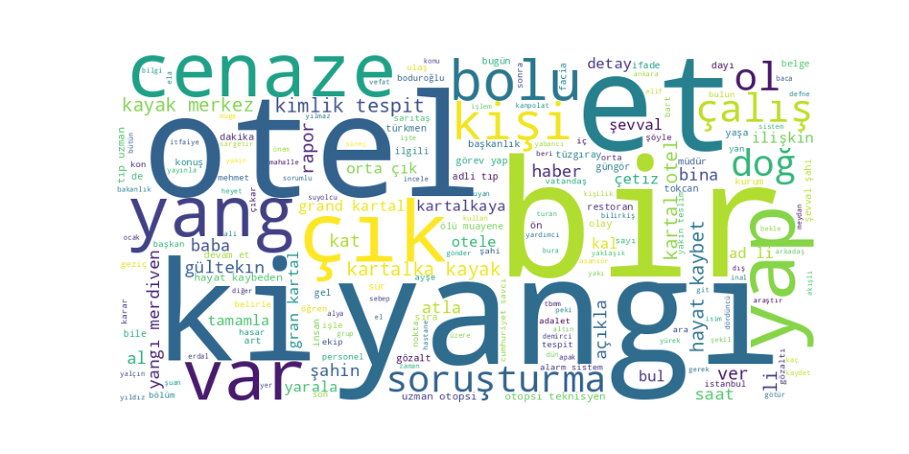
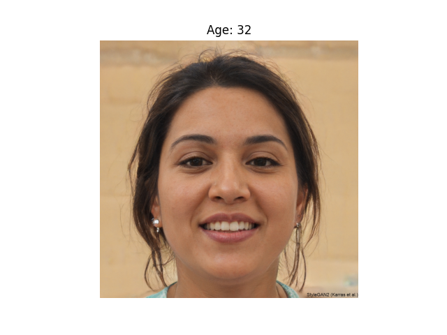
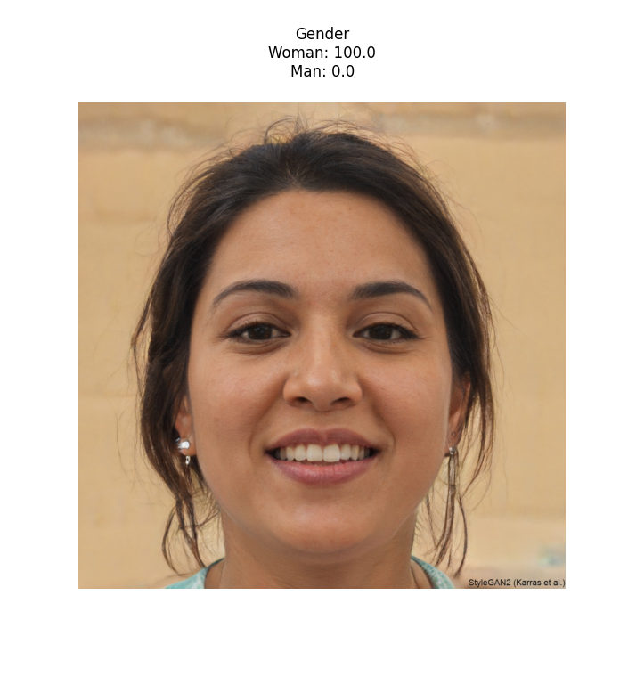
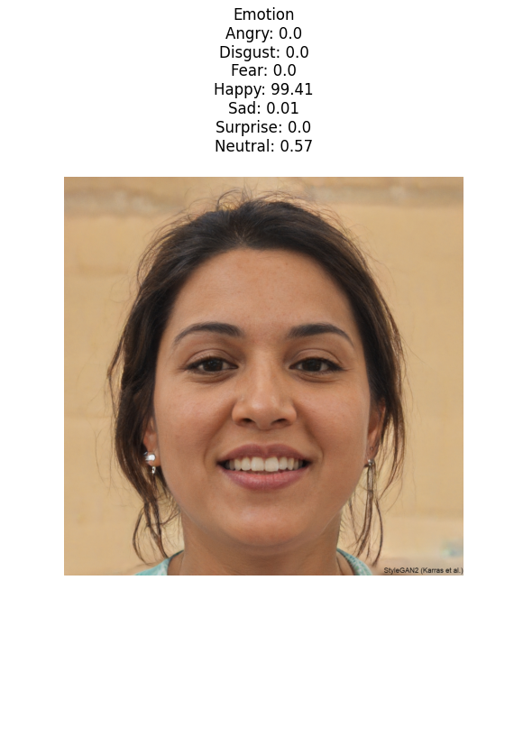

# İstatiksel Yapay Öğrenme 
## Final Sınavı
### Öğrenci adı: Muhammed Said Çakır (20241556003)

## Gereksinimler
- Python 3.8+
- Gerekli kütüphaneler:
  - deepface
  - wordcloud
  - matplotlib
  - opencv-python

## Kurulum
```sh
pip install -r requirements.txt
```

# Soru1: Metin Duygu Analizi



## Sonuç:
Label: neutral
Score: 0.9522287845611572
Metin genel olarak nötr bir duygu içeriğine sahip olarak tespit edilmiştir.

# Soru2: Yüz Analizi
DeepFace kütüphanesi kullanılarak yüz görüntüsü üzerinde yaş, cinsiyet ve duygu analizi

### Yaş Analizi:


DeepFace algoritması kişinin yaşını 32 olarak tahmin etmiştir.

### Cinsiyet Analizi:


Sistem %100 oranında kadın olarak tespit etmiştir (Woman: 100.0, Man: 0.0).

### Duygu Analizi:


Mutlu (Happy): %99.41
Nötr (Neutral): %0.57
Üzgün (Sad): %0.01
Diğer duygular (kızgın, iğrenme, korku, şaşkınlık): %0

DeepFace algoritması görüntüdeki kişiyi yüksek bir doğruluk oranıyla mutlu olarak tespit etmiştir. Kişinin gülümseyen yüz ifadesi ve pozitif görünümü bu sonucu desteklemektedir.
Kod yapısı DeepFace kütüphanesini kullanarak üç temel özelliği (yaş, cinsiyet, duygu) analiz etmekte ve matplotlib ile görselleştirmektedir. Her bir özellik için ayrı bir görselleştirme yapılmış ve sonuçlar başarılı bir şekilde gösterilmiştir.

